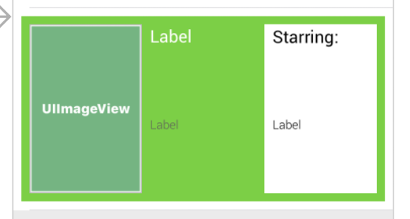
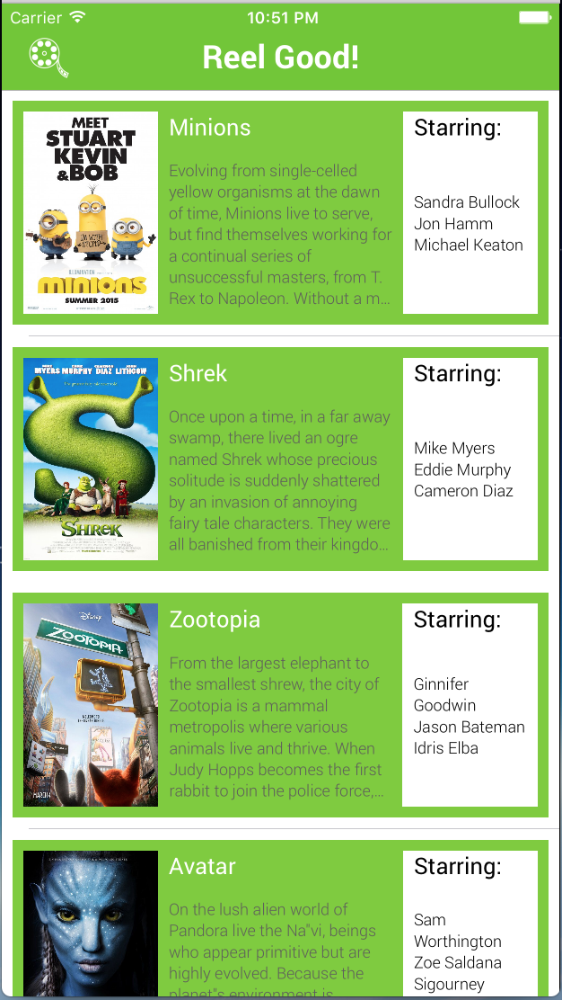

# AC3.2-Tableviews Part 3: **Customizing Table View Cells**)

---

### Readings
1. [A Beginner's Guide to AutoLayout w/ Xcode 8 - Appcoda](http://www.appcoda.com/auto-layout-guide/)
2. [Understanding AutoLayout - Apple](https://developer.apple.com/library/content/documentation/UserExperience/Conceptual/AutolayoutPG/index.html#//apple_ref/doc/uid/TP40010853-CH7-SW1)

###  Further Readings (Optional)
3. [Designing for iOS - Design+Code](https://designcode.io/iosdesign-guidelines)
4. [Extensions - Apple](https://developer.apple.com/library/content/documentation/Swift/Conceptual/Swift_Programming_Language/Extensions.html)

---
###Vocabulary

> TODO

---
### 0. Objectives
1. Further customizing `UITableViewCell` using IB **(Interface Builder)** and code
2. Reinforcing understanding of *"minimally satisfying constraints"* in AutoLayout
3. Reinforcing basics of iOS Design

---

### 1. Adding some styling

Since we know that Reel Good is going to want to use their official brand colors in a lot of places in their app, it makes sense to think ahead and try to save yourself some time with typing. It's really not a big deal to set a UI element's background color, here and there (`view.backgroundColor = UIColor.green`, `label.textColor = UIColor.purple`, etc..). But as programmers, we strive for modularity, re-usability, and maintainability. Here's what I mean:

```swift
// you can add this code somewhere at the top of UIMovieViewController
let reelGoodGreen: UIColor = UIColor(red: 109.0/255.0, green: 199.0/255.0, blue: 39.0/255.0, alpha: 1.0)
let reelGoodGray: UIColor = UIColor(red: 85.0/255.0, green: 85.0/255.0, blue: 85.0/255.0, alpha: 1.0)
```

That is what the code looks like to define the exact color of green and gray that appears in Reel Good's logo. Seems reasonable that we can just copy/past that line into each class we need, or put it someone once and give it the `public` access modifier to be available everywhere in our project.


#### Changing the `UINavigationBar` appearance

Here are some guiding rules:

1. To change the style of a `UINavigationController`, you will need to make changes to its `.navigationBar` property
2. `.tintColor` is used to change the color of navbar icons and button text
3. `.barTintColor` is used to change the background color of the navbar
4. `titleTextAttributes` is used to change the font of the navbar title
  - This property is a dictionary of key/value pairs that correspond to different attributes of the text ([see here for full list](https://developer.apple.com/reference/foundation/nsattributedstring/1652619-character_attributes)). The most common I use are:
    - `NSForegroundColorAttributeName` : `UIColor` (corresponds to text color)
    - `NSFontAttributeName` : `UIFont` (corresponds to font style)
5. Inside any view controller, you can call `self.title` to update the text that appears in a navigation controller (if there is one)

We're going to add the associated code to update the navBar inside of `UIViewController`'s `viewWillAppear` function, which is called just before the view controller's views are presented on screen. Often times you'll see small UI changes in this function, which is why we're adding the code here.

```swift
// 1. .navigationController property is Optional, so we need to do a quick conditional binding
if let navigationController: UINavigationController = self.navigationController {

	// 2. tintColor for text and icons
	navigationController.navigationBar.tintColor = UIColor.white

	// 3. barTintColor for navbar background color
	navigationController.navigationBar.barTintColor = reelGoodGreen

	// 4. titleTextAttributes is a dictionary with pre-determined keys
	navigationController.navigationBar.titleTextAttributes = [
	  NSForegroundColorAttributeName : UIColor.white
	]
}

// 5.
self.title ="Movies"
```

#### Adding a `UIBarButtonItem` to the `UINavigationBar`
This is fairly straightforward, with the trickiest part being sizing the image you're going to use to fit your navBar properly. In this case, the project includes an icon that's already sized at about 60pt for its @2x size. This is going to be purely for asthetics, but know that this `UIBarButtonItem` can function as a regular `UIButton` object, it just specifically goes into a `UINavigationContoller`

1. Search for a `UIBarButtonItem` object in Xcode and drag it into the navigation bar in story board
	- 
2. Select the new `UIBarButtonItem` and set it to be the `reel` image. And that's all there is to it!
	- 

Run the project at this point and take a peek at how much better things look already!


---

### 2. Section Headers

Right now, we have our `Movie`s being sorted by their `genre`. But its not very apparent that this is what is happening, at least to someone who would be using our app. Sure, *we* know that it's being sorted but development in iOS is about clearly communicating to your user information on screen. In this case, it would probably be better if we clearly labeled each `genre` into its own `section`, and fortunately `UITableView` has a pretty easy way to help accomodate this with the delegate function
`tableView(_:,titleForHeaderInSection:)`, or more commonly (and succintly() called `titleForHeader`. `titleForHeader` works in a very similar fasion to `cellForRow` in that it is given a `section` to indicate where we should be adding in a title.

```swift
// in MovieTableViewController
override func numberOfSections(in tableView: UITableView) -> Int {
	return 1
}

override func tableView(_ tableView: UITableView, titleForHeaderInSection section: Int) -> String? {
	return "All Movies"
}
```

Adding the above will result in displaying a single section header with the title "All Movies". This header floats above the cells of the section it is in:


We could alter this slightly for different effects, for example, to have a section header for each cell

```swift
override func numberOfSections(in tableView: UITableView) -> Int {
	return self.movieData.count
}

override func tableView(_ tableView: UITableView, numberOfRowsInSection section: Int) -> Int {
	return 1
}

override func tableView(_ tableView: UITableView, titleForHeaderInSection section: Int) -> String? {
	if section % 2 == 0 {
		return "Section A"
	}
	else {
		return "Section B"
	}
}
```


#### Exercise

We're going to want to make it obvious to our users that Movies are being sorted by their genre, so our goal is to organize each section by a specific header that corresponds to the type of movie in that section. To help you out, here are a few things you'll need:

1. You should create an enum called `MovieType`:
	```swift
		enum MovieType {
			case action, animation, drama
		}
	```
2. You should also create a helper function that will filter out all of the movies of a specific type:
	```swift
	func filterMovies(for type: MovieType) -> [Movie] {
		// your code goes here
	}
	```
3. You will need to update `cellForRow`, `numberOfRows`, `numberOfSections` and `titleForHeader` to take into account the multiple sections and the varying number of cells in each section. `if-else` conditionals can get you what you need in most cases.


<br>
<details><summary>Hint 1</summary>
<br><br>
You're going to want to use the <code>filter</code> function on <code>self.movieData</code> when you write your implementation of <code>filterMovies(for:)</code>
<br><br>
</details>
<br>

> Refer to the `/Exercises` folder to see the answer to this question

---
### 3. Exercises

While Reel Good's Lead Designer loved that you were able to match their specs exactly, they're not entirely sure they love their original design and want you to make two more types of cells that they can test. They've sent over some screenshots of their design mock ups and have asked you to recreate:

#### Alternative Version 1


---

### Alternative Version 2



#### (Optional, but fun) Adding in new fonts!

If you haven't already done so, take a look at part 2's [Extra Adding Custom Fonts](https://github.com/C4Q/AC3.2-Tableviews_Part_2#5-extra-adding-custom-fonts). It's a good exercise in getting used to the `xcodeproj` in general and it'll give your project a little more visual flair

#### Advanced:

>>> TODO: Extensions


### 6. Revealing the MVP to Reel Good


"Stunning!" - Reel Good, CEO

"... this app is becoming so beatiful..." - Reel Good, Lead Designer

"How much is this costing us?" - Reel Good, CFO

"The board will be thrilled" - Reel Good, Investor Relations

"It's OK." - Reel Good, Crusty iOS Engineer


Great work on this MVP, but now Reel Good is expecting a lot more out of the next iterration. They want a full screen detail view on the movie and some design tweaks. On top of this, your engineering team has decided that the code base needs some clean up before it gets to large! The next stage of this project will be even more challenging and there's no time to rest on laurels.

---

### Time to Reel it In

Reel Good took our latest prototype and presented it to their board of investors as the cornerstone of their mobile initiative. The extra work we put behind the design of the app must have really sold it, because Reel Good now needs one more set of changes before they take the app into beta.

For the next [MVP](https://www.quora.com/What-is-a-minimum-viable-product/answer/Suren-Samarchyan?srid=dpgi), Reel Good wants to be able to tap on the movie cell to display full details of the movie on a different screen.

After the meeting with Reel Good, we sat down with our engineering team and sketched out the necessary requirements of this next task and broke them down:

1. We have to create a new view controller to present a full screen version of the movie data
  - We need to make sure that navigation works to go to and from one of these view controllers.
  - The proper movie data has to be transferred from one view controller to the next, so we need to do some data handling

A large part of development is being able to translate feature requests into actual programming work. Taking some time to plan out a course of action before starting to code will likely save you some time in the end. Even then, there absolutely will be unforseen problems that you will encounter. But that's just part of the fun of programming.

---
### Goals
1. Create a new custom `UIViewController` to display a single `Movie` object's data
2. Understand segues in storyboard to transition between view controllers
3. Better understanding of the delegate pattern in programming.

---

### Readings
 1. [General Reference on Xcode (very useful)](http://help.apple.com/xcode/mac/8.0)
 2. [Configuring a Segue in Storyboard - Apple](http://help.apple.com/xcode/mac/8.0/#/deve5fc2eb19)
 3. [Using Segues (lots of great info here)](https://developer.apple.com/library/content/featuredarticles/ViewControllerPGforiPhoneOS/UsingSegues.html)
 4. [Navigation Controller Implementation - tuts+ (helpful reference and example)](https://code.tutsplus.com/tutorials/ios-from-scratch-with-swift-navigation-controllers-and-view-controller-hierarchies--cms-25462)

---

### 1. Adding a new `UIViewController` to Display a `Movie`

#### Storyboard Changes **(Use iPhone 6s for your simulation)**
1. Drag in a `UIViewController` into `Main.storyboard` from the *Objects Library* in the *Utilities Pane* and place it next to the `MovieTableViewController`
2. Select the prototype cell (make sure you have the actual `MovieTableViewCell` selected) and Control-Drag to the new `UIViewController`
3. On the outlet menu that pops up, select "Selection Segue > Show"
  - Note: "Accessory Selection" is the action to perform when adding an "accessory view." An example of an accessory view is the `>` (called a "chevron") you see all the way to the right on a cell in the Mail or Messages app on an iPhone.
  - The "Selection" type of segue refers to the action to take when the cell itself is tapped/selected.
4. Select the segue object in storyboard (the -> arrow), and in the *Attribute Inspector*, set it's identifier to `MovieDetailViewSegue`
5. Drag in a `UIImageView` into the view controller, giving it the following attributes:
  - `8pt` margins at the top, left, and right
  - A height of `240pt`
  - _Before adding these constraints, make sure the checkmark box for "Constrain to margins" is selected_
  - Switch the image view's `Content Mode` to `Aspect Fit`
6. Drag in 4 `UILabel`s below the `UIImageView` in a vertical row
  - Label them (in order): `Genre`, `Location`, `Summary` and `Summary Text`
  - Set their fonts to `Roboto Regular - 17pt`, except for `Summary Text` which will be `Roboto-Light - 14pt`
  - Set the number of lines for `Summary Text` to 0
7. Select **all** of the `UILabel`s at once, by holding down the Command (⌘) Key while clicking on them
  - Select *Pin* and set it to **8pt margins**, also making sure that the checkmark for "Constrain to margins" is selected
  - Set the *Vertical Content Hugging Priority* to 1000 for all labels except `Summary Text`. Instead, set the *Vertical Compression Resistance* of `Summary Text` to 1000
8. Your view controller should resemble:

  

Being able to set constraints in this batching form is one of the nice advantages of using storyboards.

#### Storyboard linking
1. Add a new file named `MovieDetailViewController` that subclasses `UIViewController` and place it in the correct folder and Xcode group
2. In `Main.storyboard` change the custom class of the view controller we just added to be `MovieDetailViewController`
3. Create outlets for each of the labels and the imageView. Name them:
  - `moviePosterImageView`, `genreLabel`, `locationLabel`, `summaryLabel`, and `summaryFullTextLabel`
4. Additionally, give `MovieDetailViewController` an instance variable of type `Movie`
  - `internal var selectedMovie: Movie!`
  - This property will hold a reference to the `Movie` from the cell that was tapped.

#### Preparing for Segue
A `UINavigationController` is unique in that it manages a _navigation stack_, which is a hierarchy of view controllers.

You can think of each view controller as being a card in a stack of cards.  When you **push** a view controller onto the stack, you're putting a new card on top of the _stack_ of cards. That top-most card is what is currently visible on screen. When you **pop** a view controller, you're taking a card off the top of the _stack_, and revealing the card/view controller just below it.

> It's important to know that all view controllers currently on the stack can be accessed through the navigation controller

The `prepare(for:sender:)` method is where we get things ready for displaying a new view controller that has been set up in storyboard.

As mentioned in the documentation for [`prepare(for:sender:)`](https://developer.apple.com/reference/appkit/nssegueperforming/1409583-performsegue), the `sender` parameter refers to the object that has requested the segue. In our case, the `sender` is expected to be a `MovieTableviewCell`. But because the `sender` is defined as being of type `Any?`, we should do a check to confirm our assumptions. Moreover, we'll need the cell to determine which movie cell was tapped.

```swift
  // 1. check sender for the cell that was tapped
  if let tappedMovieCell: MovieTableViewCell = sender as? MovieTableViewCell {

  }
```

The `segue` object is an instance of [`UIStoryboardSegue`](https://developer.apple.com/reference/uikit/uistoryboardsegue), which has an instance property of `indentifier` that refers to the identifier string we gave to the segue earlier in `Main.storyboard` (we used `MovieDetailViewSegue`). In order to make sure that we have the correct segue (a storyboard can have many segues), we need to check that the identifier matches one that we expect:

```swift
  // 1. check sender for the cell that was tapped
  if let tappedMovieCell: MovieTableViewCell = sender as? MovieTableViewCell {

    // 2. check for the right storyboard segue
    if segue.identifier == "MovieDetailViewSegue" {

    }
  }
```

While generally you should avoid force unwrapping, because we're certain of both the `sender` and the storyboard `segue` we can say with some certainty that the `segue.destination` is going to be a `MovieDetailViewController`:

`let movieDetailViewController: MovieDetailViewController = segue.destination as! MovieDetailViewController`

We now have the tapped cell (`sender`) and the instance of `MovieDetailViewController` (`segue.destination`), but how do we get the `Movie` object that corresponds to the cell we selected?

We already wrote a piece of code in `cellForRow` that arranged our `movieData` by genre, but that required having the current `indexPath`. Fortunately, we can get that index path using a function of `UITableview` called `indexPath(for:)`. Using that function, along with our code from `cellForRow` we have:

```swift
  // 1. check sender for the cell that was tapped
  if let tappedMovieCell: MovieTableViewCell = sender as? MovieTableViewCell {

    // 2. check for the right storyboard segue
    if segue.identifier == "MovieDetailViewSegue" {

      // 3. get reference to the destination view controller
      let movieDetailViewController: MovieDetailViewController = segue.destination as! MovieDetailViewController

      // 4. get our cell's indexPath
      let cellIndexPath: IndexPath = self.tableView.indexPath(for: tappedMovieCell)!

      // 5. get our cell's Movie
      guard let genre = Genre.init(rawValue: cellIndexPath.section),
       let data = byGenre(genre) else {
         return
      }

      // 6. set the destionation's selectedMovie property
      let selectedMovie: Movie = data[cellIndexPath.row]
      movieDetailViewController.selectedMovie = selectedMovie
    }
  }
```

Now that the destination `MovieDetailViewController` has its `Movie` object reference, let's populate the labels:

```swift
  movieDetailViewController.moviePosterImageView.image = UIImage(named: selectedMovie.poster)
  movieDetailViewController.genreLabel.text = "Genre: " + selectedMovie.genre.capitalized
  movieDetailViewController.locationLabel.text = "Locations: " + selectedMovie.locations.joined(separator: ", ")
  movieDetailViewController.summaryFullTextLabel.text = selectedMovie.summary
```

Go ahead and run the poject at this point to see if the data gets passed along properly...

`fatal error: unexpectedly found nil while unwrapping an Optional value`

> **Discuss & Debug**:
Why are we getting force unwrapping errors?

#### Updating `MovieDetailViewController` with a `Movie`

Let's move our code into `MovieDetailViewController` in a new function, `updateViews(for:)`:

```swift
  internal func updateViews(for movie: Movie) {
    self.moviePosterImageView.image = UIImage(named: movie.poster)!
    self.genreLabel.text = "Genre: " + movie.genre.capitalized
    self.locationLabel.text = "Locations: " + movie.locations.joined(separator: ", ")
    self.summaryFullTextLabel.text = movie.summary
  }
```

And lastly, let's call `updateViews(for:)` in `viewDidLoad`

```swift
  override func viewDidLoad() {
    super.viewDidLoad()

    self.updateViews(for: self.selectedMovie)
  }
```

And re-run the project now. You should see


---

### 2. Exercise

You may have noticed that we didn't add in a label for `Movie.cast`.

What we'd like to do is be able to present a view controller of just the `Actor`s for each movie when you tap on an accessory view of the `MovieTableviewCell`.

To acheive that goal, here are a few pointers:

1. Create a new `UIViewController` sublcass called `MovieCastDetailViewController`
2. Drag a `UIViewController` into storyboard, and change its custom class to `MovieCastDetailViewController`
3. Add two labels to this view with the following details (screen shot):
  - `castTitleLabel`:
    - `Roboto - Bold, 24pt`, Number of Lines = 1, `8pt` margins to top, left, right. `Vertical Content Hugging - 1000`
  - `castListLabel`:
    - `Roboto - Regular, 18pt`, Number of Lines = 0, `8pt` top margin to `castTitleLabel`, `24pt` left margin, `8pt` right margin.
  - 
3. Create a segue between `MovieTableviewCell` and `MovieCastDetailViewController`, though instead of chosing a segue of type "Selection Segue" you'll be using "Accessory Action". Give the segue and identifier of `MovieCastDetailSegue`
  - Creating the segue of type "Accessory Action" should automatically add a "Disclosure Indicator" accesory view to the `MovieTableviewCell`, but be sure to switch it to "Detail"
  - Storyboard will look something like this:
  - 
5. Update your code in `MovieTableViewController.prepare(for:sender:)` to recognize the new segue identifier
6. Populate your `castListLabel` with the `Actor` names so that your final product looks like


#### Other Optional Exercises
1. Update the title of the `UINavigationController` of `MovieDetailViewController` to have the name of the `Movie` being viewed
2. Same as the above, but for the `MovieCastDetailViewController`
3. You may have noticed that some of the labels get hidden when viewing the project on an iPhone 5s. Swap the `summaryText` `UILabel` with a `UITextView` to allow for this portion of the text to be scrollable. Then under “behavior” in attributes, uncheck both Editable and Selectable.
