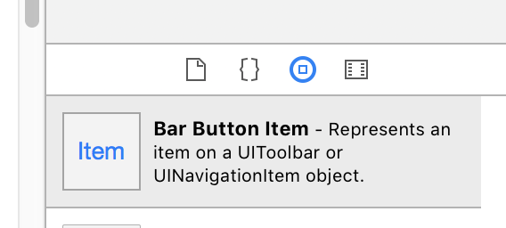
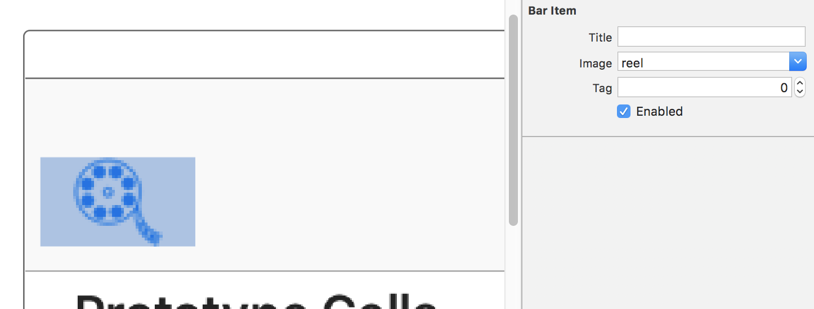
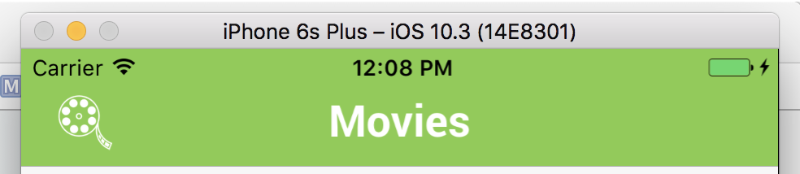
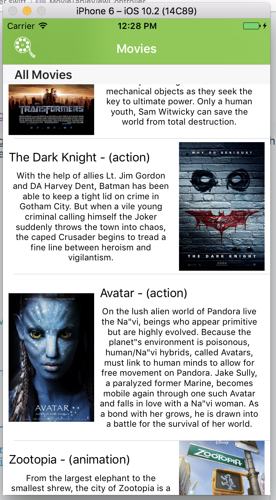
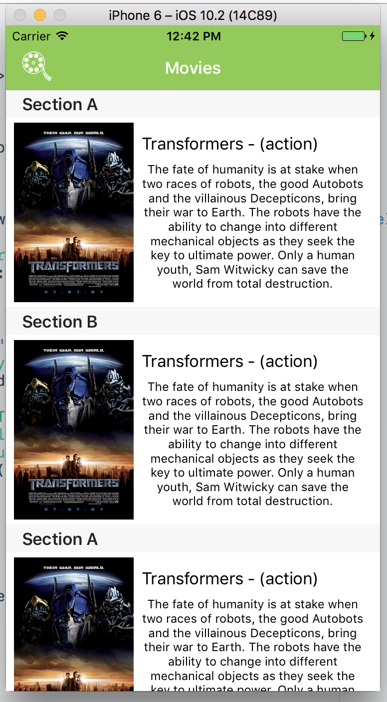
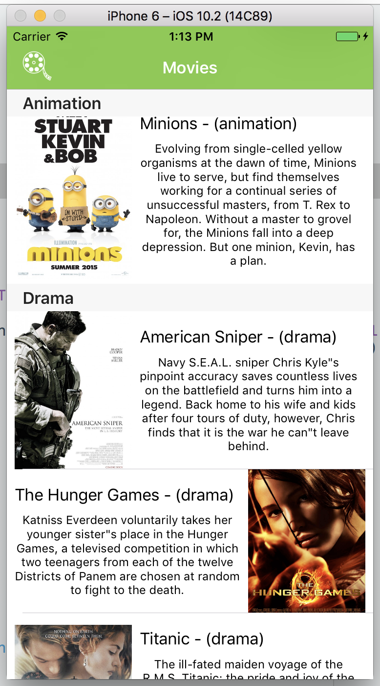
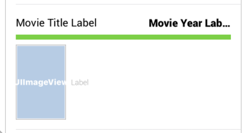
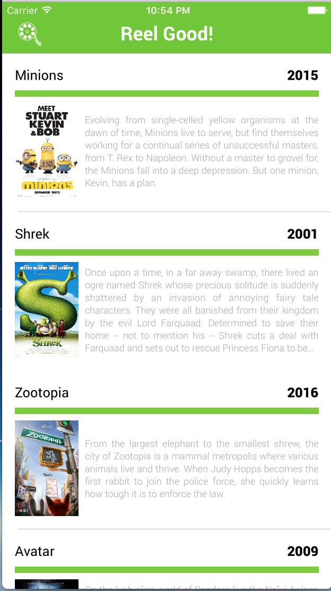

# AC3.2-Tableviews Part 3: **Customizing Table View Cells**)

---

### Readings
1. [A Beginner's Guide to AutoLayout w/ Xcode 8 - Appcoda](http://www.appcoda.com/auto-layout-guide/)
2. [Understanding AutoLayout - Apple](https://developer.apple.com/library/content/documentation/UserExperience/Conceptual/AutolayoutPG/index.html#//apple_ref/doc/uid/TP40010853-CH7-SW1)

####  Further Readings (Optional)
3. [Designing for iOS - Design+Code](https://designcode.io/iosdesign-guidelines)
4. [Extensions - Apple](https://developer.apple.com/library/content/documentation/Swift/Conceptual/Swift_Programming_Language/Extensions.html)

#### Advanced Readings
1. [Extensions - Apple Doc](https://developer.apple.com/library/content/documentation/Swift/Conceptual/Swift_Programming_Language/Extensions.html)

---
### Vocabulary

1. `titleForHeader` - shorthand for `tableView(_:,titleForHeaderInSection:)`
2. **Enumeration** - An enumeration defines a common type for a group of related values and enables you to work with those values in a type-safe way within your code. ([Apple](https://itun.es/us/jEUH0.l))
3. **Extension** - Extensions add new functionality to an existing class, structure, enumeration, or protocol type. This includes the ability to extend types for which you do not have access to the original source code. ([Apple](https://itun.es/us/jEUH0.l))

---
### 0. Objectives
1. Further customizing `UITableViewCell` using IB **(Interface Builder)** and code
2. Reinforcing understanding of *"minimally satisfying constraints"* in AutoLayout
3. Reinforcing basics of iOS Design

---

### 1. Adding some styling

Since we know that Reel Good is going to want to use their official brand colors in a lot of places in their app, it makes sense to think ahead and try to save yourself some time with typing. It's really not a big deal to set a UI element's background color, here and there (`view.backgroundColor = UIColor.green`, `label.textColor = UIColor.purple`, etc..). But as programmers, we strive for modularity, re-usability, and maintainability. Here's what I mean:

```swift
// you can add this code somewhere at the top of UIMovieViewController
let reelGoodGreen: UIColor = UIColor(red: 109.0/255.0, green: 199.0/255.0, blue: 39.0/255.0, alpha: 1.0)
let reelGoodGray: UIColor = UIColor(red: 85.0/255.0, green: 85.0/255.0, blue: 85.0/255.0, alpha: 1.0)
```

That is what the code looks like to define the exact color of green and gray that appears in Reel Good's logo. Seems reasonable that we can just copy/past that line into each class we need, or put it someone once and give it the `public` access modifier to be available everywhere in our project.


#### Changing the `UINavigationBar` appearance

Here are some guiding rules:

1. To change the style of a `UINavigationController`, you will need to make changes to its `.navigationBar` property
2. `.tintColor` is used to change the color of navbar icons and button text
3. `.barTintColor` is used to change the background color of the navbar
4. `titleTextAttributes` is used to change the font of the navbar title
  - This property is a dictionary of key/value pairs that correspond to different attributes of the text ([see here for full list](https://developer.apple.com/reference/foundation/nsattributedstring/1652619-character_attributes)). The most common I use are:
    - `NSForegroundColorAttributeName` : `UIColor` (corresponds to text color)
    - `NSFontAttributeName` : `UIFont` (corresponds to font style)
5. Inside any view controller, you can call `self.title` to update the text that appears in a navigation controller (if there is one)

We're going to add the associated code to update the navBar inside of `UIViewController`'s `viewWillAppear` function, which is called just before the view controller's views are presented on screen. Often times you'll see small UI changes in this function, which is why we're adding the code here.

```swift
// 1. .navigationController property is Optional, so we need to do a quick conditional binding
if let navigationController: UINavigationController = self.navigationController {

	// 2. tintColor for text and icons
	navigationController.navigationBar.tintColor = UIColor.white

	// 3. barTintColor for navbar background color
	navigationController.navigationBar.barTintColor = reelGoodGreen

	// 4. titleTextAttributes is a dictionary with pre-determined keys
	navigationController.navigationBar.titleTextAttributes = [
	  NSForegroundColorAttributeName : UIColor.white
	]
}

// 5.
self.title ="Movies"
```

#### Adding a `UIBarButtonItem` to the `UINavigationBar`
This is fairly straightforward, with the trickiest part being sizing the image you're going to use to fit your navBar properly. In this case, the project includes an icon that's already sized at about 60pt for its @2x size. This is going to be purely for asthetics, but know that this `UIBarButtonItem` can function as a regular `UIButton` object, it just specifically goes into a `UINavigationContoller`

1. Search for a `UIBarButtonItem` object in Xcode and drag it into the navigation bar in story board
	- 
2. Select the new `UIBarButtonItem` and set it to be the `reel` image. And that's all there is to it!
	- 

Run the project at this point and take a peek at how much better things look already!



---

### 2. Section Headers

Right now, we have our `Movie`s being sorted by their `genre`. But its not very apparent that this is what is happening, at least to someone who would be using our app. Sure, *we* know that it's being sorted but development in iOS is about clearly communicating to your user information on screen. In this case, it would probably be better if we clearly labeled each `genre` into its own `section`, and fortunately `UITableView` has a pretty easy way to help accomodate this with the delegate function
`tableView(_:,titleForHeaderInSection:)`, or more commonly (and succintly() called `titleForHeader`. `titleForHeader` works in a very similar fasion to `cellForRow` in that it is given a `section` to indicate where we should be adding in a title.

```swift
// in MovieTableViewController
override func numberOfSections(in tableView: UITableView) -> Int {
	return 1
}

override func tableView(_ tableView: UITableView, titleForHeaderInSection section: Int) -> String? {
	return "All Movies"
}
```

Adding the above will result in displaying a single section header with the title "All Movies". This header floats above the cells of the section it is in:



We could alter this slightly for different effects, for example, to have a section header for each cell

```swift
override func numberOfSections(in tableView: UITableView) -> Int {
	return self.movieData.count
}

override func tableView(_ tableView: UITableView, numberOfRowsInSection section: Int) -> Int {
	return 1
}

override func tableView(_ tableView: UITableView, titleForHeaderInSection section: Int) -> String? {
	if section % 2 == 0 {
		return "Section A"
	}
	else {
		return "Section B"
	}
}
```



### 3. Exercises

> Note: These exercises do no have accompanying tests

We're going to want to make it obvious to our users that Movies are being sorted by their genre, so our goal is to organize each section by a specific header that corresponds to the type of movie in that section. To help you out, here are a few things you'll need:

1. You should create an enum called `MovieType`:
	```swift
		enum MovieType {
			case action, animation, drama
		}
	```
2. You should also create a helper function that will filter out all of the movies of a specific type:
	```swift
	func filterMovies(for type: MovieType) -> [Movie] {
		// your code goes here
	}
	```
3. You will need to update `cellForRow`, `numberOfRows`, `numberOfSections` and `titleForHeader` to take into account the multiple sections and the varying number of cells in each section. `if-else` conditionals can get you what you need in most cases.



<br>
<details><summary>Hint 1</summary>
<br><br>
You're going to want to use the <code>filter</code> function on <code>self.movieData</code> when you write your implementation of <code>filterMovies(for:)</code>
<br><br>
</details>
<br>

> Refer to the `/Exercises` folder to see the answer to this question

---
### 4. UI Exercises

While Reel Good's Lead Designer loved that you were able to match their specs exactly, they're not entirely sure they love their original design and want you to make one more type of cell that they can test. They've sent over some screenshots of their design mock ups and have asked you to recreate:

#### Alternative Version



You will need to reproduce many of the same steps in creating the first two prototype cells

#### (Optional, but fun) Adding in new fonts!

If you haven't already done so, take a look at part 2's [Extra Adding Custom Fonts](https://github.com/C4Q/AC3.2-Tableviews_Part_2#5-extra-adding-custom-fonts). It's a good exercise in getting used to the `xcodeproj` in general and it'll give your project a little more visual flair


#### Advanced:

`Extensions` allow you to *extend* functionality of an object that has already been defined. For example, say we needed to get the cubed value of an `Int` in our app. One approach would be to write a function for it like so:

```swift
func cube(_ number: Int) -> Int {
	return number * number * number
}

let twoCubed = cube(2) // 8
let threeCubed = cube(3) // 27
```

An alternative to this would be to *extend* the existing functionality of an `Int` object using an `Extension`:

```swift
extension Int {
	func cubed() -> Int {
		return self *self * self
	}
}
```

This is like we took the built-in `Int` object and added a whole new function! We're now able to call this function on any `Int` in our project like so:

```swift
let fourCubed  = 4.cubed() // 64
let fiveCubed = 5.cubed() // 125
```

You task is to create an `Extension` on `UIColor` to create two functions, `reelGoodGreen()->UIColor` and `reelGoodGray()->UIColor`. The purpose of these two functions is to more easily call Reel Good's brand specific colors all over the app.

After you create the extension, you should then be able to call the new functions like so:

```swift
let green = UIColor().reelGoodGreen()
let gray = UIColor().reelGoodGray()
```
